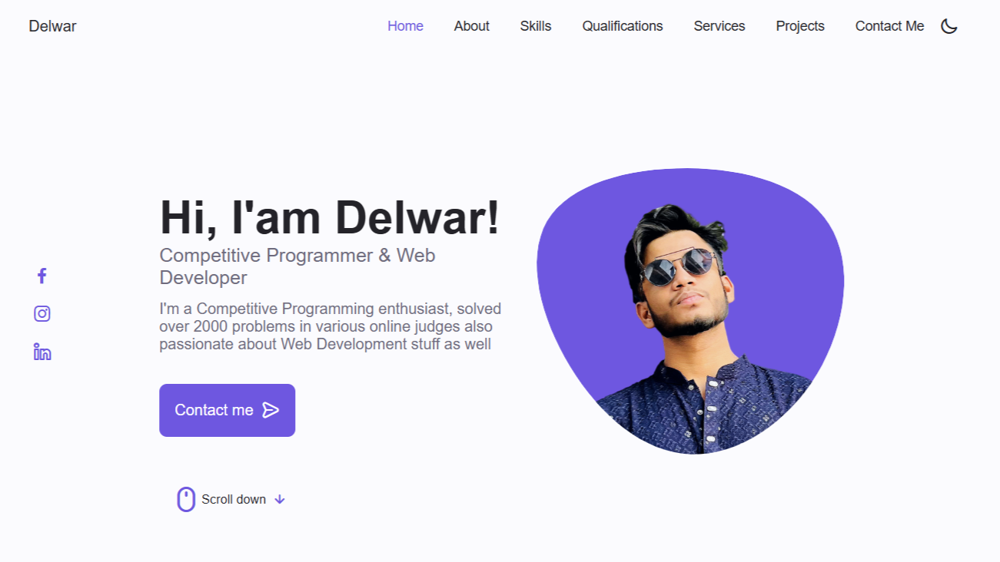
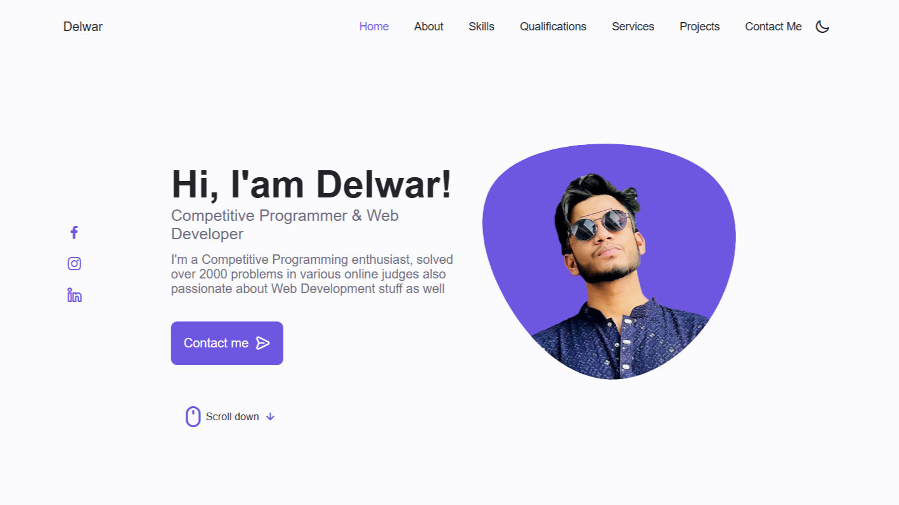
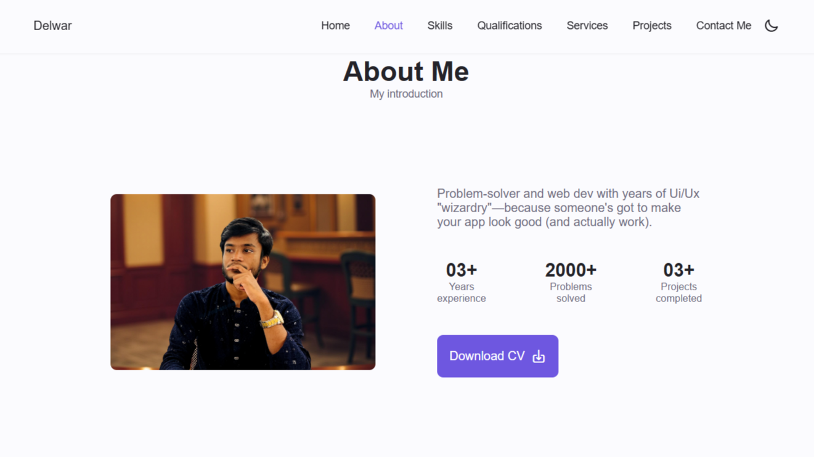
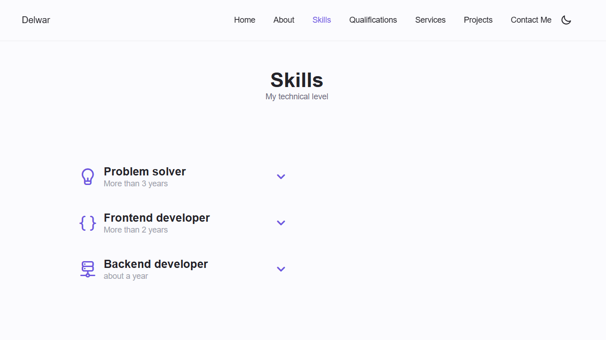
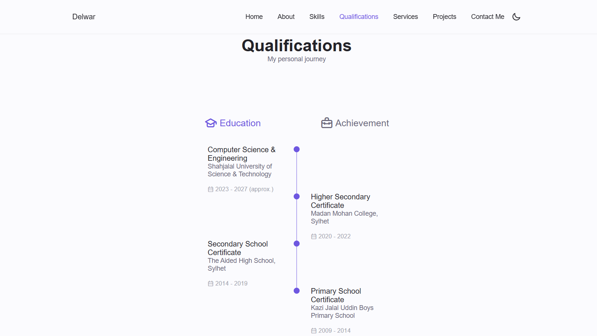
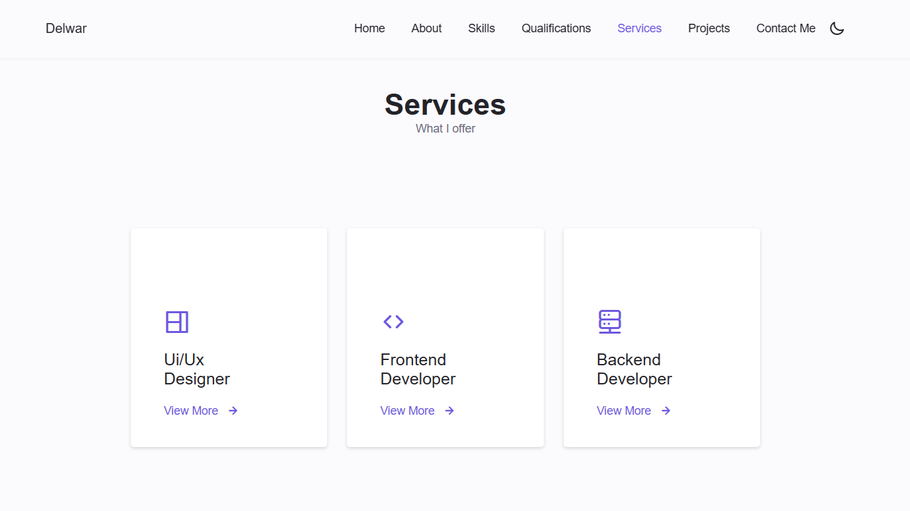
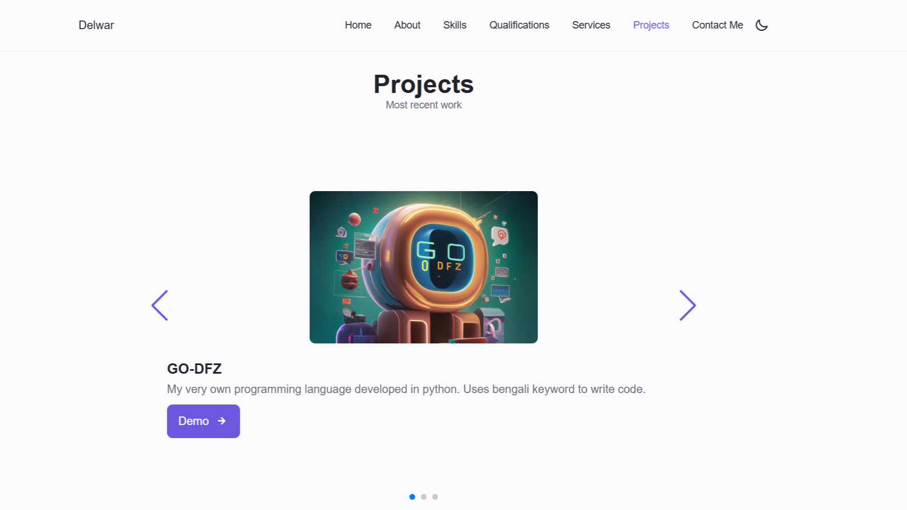
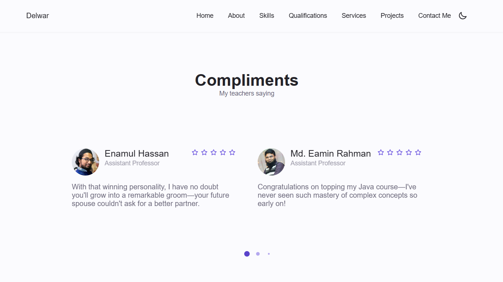
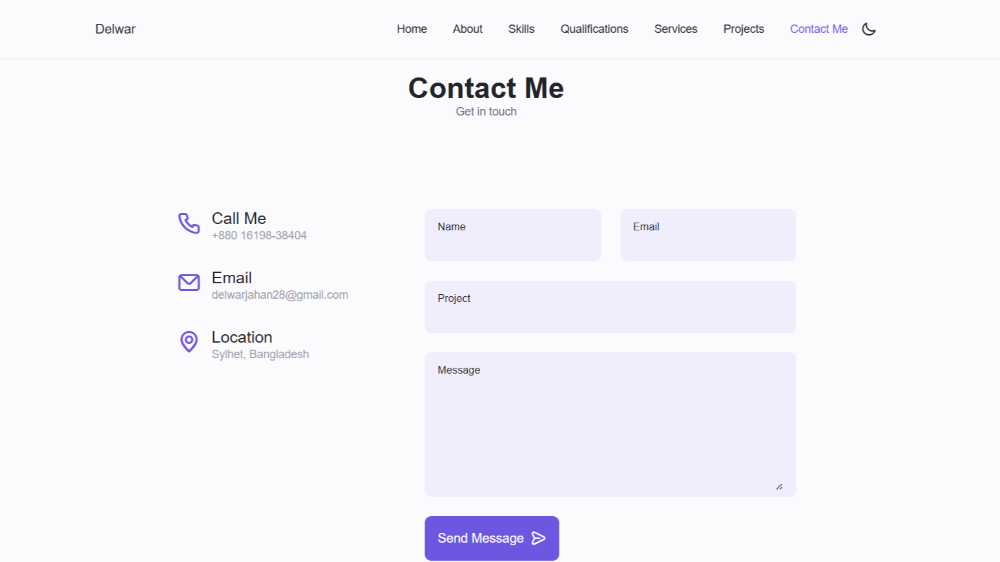

# MD. Delwar Jahan – Portfolio

Welcome to my personal portfolio! I’m **MD. Delwar Jahan**, a passionate competitive programmer and web developer aiming to become a Grandmaster on Codeforces. Here you can explore my projects, skills, and ways to connect with me.

---

## 📖 Table of Contents

- [About Me](#about-me)  
- [Demo](#demo)  
- [Features](#features)  
- [Tech Stack](#tech-stack)  
- [Usage](#usage)  
- [Roadmap](#roadmap)  
- [Contributing](#contributing)  
- [License](#license)  
- [Contact](#stay-connected)  

---

## 💡 About Me

I’m **MD. Delwar Jahan**, a **Expert** on Codeforces and participated in **10+** Inter University Programming Contest (IUPC).
- 🔭 I’m currently building and refining my portfolio website.  
- 🌱 I’m learning advanced algorithms: Dynamic Programming on strings, Fast Walsh–Hadamard Transform, and more.  
- 🖥️ I love solving Adhoc problems and sharing knowledge through tutorials and blog posts.

---

## 🚀 Demo

Live site: [https://your-portfolio-url.com](https://your-portfolio-url.com)

---

## ✨ Features

- **Responsive design**: Mobile-first, works flawlessly on all devices  
- **Dark/Light mode** toggle  
- **Project showcase** with interactive cards  
- **Contact form** powered by EmailJS  

---

## 🛠 Tech Stack

| Category        | Technologies                          |
| --------------- | --------------------------------------|
| **Frontend**    | HTML, CSS, JavaScript          |
| **Hosting**     | Vercel                                |
| **Analytics**   | Google Analytics                      |
| **Forms**       | EmailJS                               |

---

## 📝 Usage & Navigation

1. **Homepage**  
   Overview of who I am, highlighted skills, and a featured project carousel.  
   
2. **About**  
    Dive into my background, education, and problem solving stats.  
    
3. **Skills**  
    Dive into my skills, what am I good at and some Online Judges stats that I used to solve problems.  
    
4. **Qualifications**  
    My qualifications, where I studied and some of my achievements as well.  
    
5. **Services**  
    Services that I provide, things that I'd love to do. 
    
6. **Projects**  
    Some of the projects I've made in undergrad life. 
    
7. **Compliments**  
    In my undergrad journey I've recieved plenty of compliments from my professors, here are some of them. 
    
8. **Contact Me**  
    If you're interested to work with me, feel free to reach out. 
    

---

## 📈 Roadmap & Future Enhancements

  - 🔄 Add **automated theme synchronization** with user OS preferences.  
  - 📊 Embed a **dynamic stats widget** showing live Codeforces contest participation and rankings.  

---

## 🤗 Contributing & Community

I welcome your ideas, bug reports, and pull requests! To help this project grow

---

## 📜 License

This project is open source under the **Apache 2.0 License**.  
See [LICENSE](./LICENSE) for the complete terms and conditions.

---

## 📬 Stay Connected

- ✉️ **Email**: delwarjahan28@gmail.com  
- 💼 **LinkedIn**: [Smash it](https://www.linkedin.com/in/delwar-jahan-957067251/)  
- 🐦 **Twitter**: [Smash it](https://x.com/delwar03)  
- 👨‍💻 **CodeForces**: [Smash it](https://codeforces.com/profile/delwar_03_)  
- 🗡️ **CodeChef**: [Smash it](https://www.codechef.com/users/delwar03)  
- 🎯 **AtCoder**: [Smash it](https://atcoder.jp/users/delwar_03_)  
- 🏠 **Website**: [Demo](https://your-portfolio-url.com)

---

> “Strive not to be a success, but rather to be of value.” – Albert Einstein  
